**CDE4301 IS-403**

# 1. Introduction (Shannen) 
**1.1. Food Insecurity**

&nbsp;&nbsp;&nbsp;&nbsp;&nbsp;&nbsp;Food insecurity is the lack of consistent access to enough safe and nutritious food for normal growth and development. (Anthem, 2025) It prevents people from maintaining an active and healthy lifestyle. There are a multitude of factors that plague communities and contribute to food insecurity. Examples include climate change affecting crop yields, poverty limiting people’s ability to afford food, conflicts and wars disrupting food supply chains and poor infrastructure making it harder for food to reach those in need. (World Food Program USA, 2025)

&nbsp;&nbsp;&nbsp;&nbsp;&nbsp;&nbsp;Throughout history, humans have continuously faced the challenge of producing enough food to sustain an ever-growing population. To adapt, three major revolutions in agriculture have taken place. During the First Agricultural Revolution, people shifted from hunting and gathering to farming and domesticating animals, allowing for more stable food sources. With the advent of the Industrial Revolution, the Second Agricultural Revolution introduced mechanisation, crop rotation and selective breeding, greatly increasing agricultural productivity. (Park, 2022) The Green Revolution then gained momentum in the 1900s and replaced traditional methods of cultivation. It involved new high-yield crop varieties, synthetic fertilisers, pesticides and irrigation systems, which significantly boosted global food production and helped reduce famine in developing countries. (Pereira, 2009) Advances in science and technology have enabled us to produce food more efficiently, feeding a growing global population. 

1.1.1. *Increasing Food Production*

&nbsp;&nbsp;&nbsp;&nbsp;&nbsp;&nbsp;Success in increasing food production has continued in recent years. Globally, hunger levels have dropped, with the percentage of undernourished (Appendix) decreasing from 12% to 8%. (FAO et al., 2025) 

1.1.2. *Beyond Food Production: The Other Dimensions of Food Insecurity*

&nbsp;&nbsp;&nbsp;&nbsp;&nbsp;&nbsp;While the physical food availability is important, it is only one aspect of food insecurity. Economic and physical access to food, food utilisation and stability of these factors are equally critical. (World Bank Group, 2025) In the pursuit of productivity and profit, issues such as rising food prices, environmental degradation and social inequalities were often overlooked or even exacerbated. (Dorward, 2013) More importantly, many people still do not receive adequate nutrition from the food they consume, highlighting that availability alone does not guarantee food security. (Bhardwaj et al., 2024)

1.1.3. *Decreasing Nutritional Content in Food Produced*

&nbsp;&nbsp;&nbsp;&nbsp;&nbsp;&nbsp;A major conundrum of modern food systems is the decline in nutritional quality. The focus on high-yield, fast-growing crop varieties, coupled with the intensive use of chemical fertilisers and pesticides, has gradually reduced the levels of essential vitamins and minerals in staple foods. Modern crops such as rice, wheat and maize contain lower concentrations of nutrients like iron, zinc and protein compared to traditional varieties. (Bhardwaj et al., 2024) Furthermore, monoculture farming and soil degradation have limited the diversity of nutrients available in our diets. (Kaur et al., 2024)

&nbsp;&nbsp;&nbsp;&nbsp;&nbsp;&nbsp;Simultaneously, global diets have shifted towards highly processed, calorie-dense but nutrient-poor foods. (Popkin & Ng, 2021) This trend widens dietary inequality as nutritious food becomes more expensive to produce and less accessible. (Hoenink et al., 2024) Resultantly, individuals who rely primarily on affordable and convenient unhealthy options are more susceptible to maladies such as weakened immune system and mental health problems due to malnutrition (Appendix). (Saunders & Smith, 2010)
	
1.1.4. *The Fourth Agricultural Revolution*

&nbsp;&nbsp;&nbsp;&nbsp;&nbsp;&nbsp;The Fourth Agricultural Revolution, also known as Agriculture 4.0 or smart farming, represents the next phase in agricultural transformation. Its two core components are precision agriculture and advanced technological integration. Precision agriculture focuses on targeted management of soil, water and nutrient inputs to help crops reach optimal growth while minimising waste. The second component involves the use of advanced technologies such as artificial intelligence (AI), the Internet of Things (IoT), robotics and big data analysis. (Javaid et al., 2022) Together, these approaches enable real-time monitoring of soil conditions, crop health and resource use, allowing farmers to optimise inputs like water and fertilisers, thereby improving yields without depleting natural resources. (Verdouw et al., 2021)

&nbsp;&nbsp;&nbsp;&nbsp;&nbsp;&nbsp;Addressing food insecurity today requires a dual focus: not only increasing food production but also improving the nutritional quality of food and ensuring equitable access. Agriculture 4.0 provides an opportunity to achieve this balance by emphasising sustainability and data-driven decision-making. 

  **1.2. Food Insecurity in Singapore**

1.2.1. *The Urgent Need for Food Security*

&nbsp;&nbsp;&nbsp;&nbsp;&nbsp;&nbsp;Due to land scarcity and the lack of natural resources, Singapore imports more than 90% of its food and only 1% of its land is allocated for agricultural use. This heavy reliance on imports is not sustainable as global supply chains are vulnerable to disruptions from climate change, political instability or pandemics. To address this, the Singapore Food Agency (SFA) has implemented the “Three Food Baskets” strategy. It focuses on diversifying food import sources to reduce dependency on any single country, growing overseas by investing in food production abroad and growing locally. (Lim, 2021) With regard to local food production, as part of the Singapore Green Plan 2030, the nation aims to produce 30% of its nutritional needs locally by 2030. (Singapore Green Plan 2030, 2024) Measures supporting this goal include community gardening programs (Teng & Montesclaros, 2017), funding research for sustainable urban farming (Tan, 2022) and promoting indoor farms. (Begum, 2022) Despite these initiatives, Singapore continues to face challenges in achieving substantial local food production with the 2030 target imminent. (Tham, 2024)

1.2.2. *Indoor Farming*

&nbsp;&nbsp;&nbsp;&nbsp;&nbsp;&nbsp;Indoor farm refers to the cultivation of crops in a controlled and enclosed environment. (SFA, 2023)  It involves different methods such as vertical farming, hydroponics, aeroponics, and aquaponics. These allow for food to be produced year-round, more sustainably and safely. (Kish, 2024) Locally, the efficient use of limited land and stable supply are crucial. The government has actively funded and supported indoor farms, albeit with limited success, as many continue to struggle due to high costs of operations, stringent regulations and a shortage of highly skilled labour. (Loh, 2024) Thus, the focus has shifted toward funding the adoption of advanced technology including automated farming equipment and infrastructure. (Begum, 2025a)

1.2.3. *Why Indoor Farming Remains Essential*

&nbsp;&nbsp;&nbsp;&nbsp;&nbsp;&nbsp;Singaporean consumers often choose locally grown produce for its freshness, safety and lack of pesticides, while those who prefer imported food do so because of lower prices, greater variety and perceived better taste and quality. (Tham, 2024) With the adoption of Agriculture 4.0 technologies, indoor farms have the potential to address these gaps. Precision agriculture can help improve efficiency, optimise resource use and enhance crop quality. (Rathor et al., 2024) Over time, these advancements could reduce production costs and expand the variety of locally grown produce, allowing indoor farms to better meet consumer expectations while maintaining their inherent advantages. Furthermore, the Singapore Green Plan 2030 was recently postponed to 2035, with renewed plans to support indoor farms and revised targets to increase production of both vegetable and protein. While progress is slow, it is premature to abandon efforts to expand indoor farms and investment in these farms cannot be overlooked. (Begum, 2025b)

  **1.3. Problem Statement**

&nbsp;&nbsp;&nbsp;&nbsp;&nbsp;&nbsp;Having established the challenges of food insecurity and potential of indoor farming in Singapore, the problem can be summarised as follows: Singapore aims to increase local production to meet its nutritional needs and improve food security. However, indoor farms struggle to remain viable while consumers continue to prefer imported food for its lower prices and perceived quality. 

&nbsp;&nbsp;&nbsp;&nbsp;&nbsp;&nbsp;To mitigate this problem, we aim to support indoor farms in enhancing nutritional content through three key areas: controlling cyanobacteria growth, cultivating microgreens and implementing sensor-based monitoring.

1.3.1. *Cyanobacteria Growth*

&nbsp;&nbsp;&nbsp;&nbsp;&nbsp;&nbsp;While indoor farms have reduced many potential contaminants, cyanobacteria continue to pose a significant challenge as they compete with plants for essential nutrients, reducing plant growth and consequently, the nutritional content of it. (Wang et al., 2021) Additionally, cyanobacteria can form biofilms that harbour pathogens and produce toxins, posing further risks. They are pervasive, growing rapidly in many areas, from pipes to irrigation lines. Regular maintenance is therefore essential, including weekly inspections, mechanical cleaning and chlorine-based disinfection. (An et al., 2024)

1.3.2. *Shifting Focus: Microgreens over Regular Greens*

Our microgreen of choice is duckweed, a rapidly growing and high-protein food source. It has 20-35g of protein per 100g dry weight. (Appenroth et al., 2017) In comparison, Pak Choi, a locally familiar vegetable, contains about 1.4g of protein per 100g fresh weight which corresponds to about 18g of protein per 100g dry weight. (WebMD, n.d.) 
While duckweed doubles in biomass within 3 days so it can be harvested a few times a week (ScienceDirect, 2016), Pak Choi can only be harvested every 3 weeks. (NParks, 2023) Thus, cultivating duckweed allows indoor farms to produce more protein quickly and easily. Already consumed in countries such as Thailand, duckweed demonstrates considerable potential as a future food ingredient. (Zięć et al., 2025) With continued research and development, it could play a valuable role in promoting nutritious diets while providing a highly productive alternative to traditional greens. 

&nbsp;&nbsp;&nbsp;&nbsp;&nbsp;&nbsp;Furthermore, microgreens offer better commercial viability. While indoor farms have traditionally focused on Asian leafy greens to match consumer preferences, these crops are often difficult to cultivate indoors and yield lower profit margins. (Tham, 2024) By incorporating microgreens alongside locally familiar vegetables, indoor farms can improve both the nutritional quality and profitability of their produce, while better meeting consumer expectations for pricing and variety. (EDB, 2025)

&nbsp;&nbsp;&nbsp;&nbsp;&nbsp;&nbsp;Our microgreen of choice is duckweed, a rapidly growing and high-protein food source. It has 20-35g of protein per 100g dry weight. (Appenroth et al., 2017) In comparison, Pak Choi, a locally familiar vegetable, contains about 1.4g of protein per 100g fresh weight which corresponds to about 18g of protein per 100g dry weight. (WebMD, n.d.) 
While duckweed doubles in biomass within 3 days so it can be harvested a few times a week (ScienceDirect, 2016), Pak Choi can only be harvested every 3 weeks. (NParks, 2023) Thus, cultivating duckweed allows indoor farms to produce more protein quickly and easily. Already consumed in countries such as Thailand, duckweed demonstrates considerable potential as a future food ingredient. (Zięć et al., 2025) With continued research and development, it could play a valuable role in promoting nutritious diets while providing a highly productive alternative to traditional greens. 

1.3.3. *Sensor-based Monitoring*

&nbsp;&nbsp;&nbsp;&nbsp;&nbsp;&nbsp;Decision-making in indoor farms can be improved by leveraging real-time data collected through sensors, a key element of precision agriculture. These sensors monitor critical factors such as environmental conditions and nutrient levels, enabling farmers to make informed, timely decisions that optimise plant growth, maximise nutritional content and prevent potential issues before they affect yield or quality. (Verdouw et al., 2021)

  **1.4. Interaction between Cyanobacteria and Duckweed**

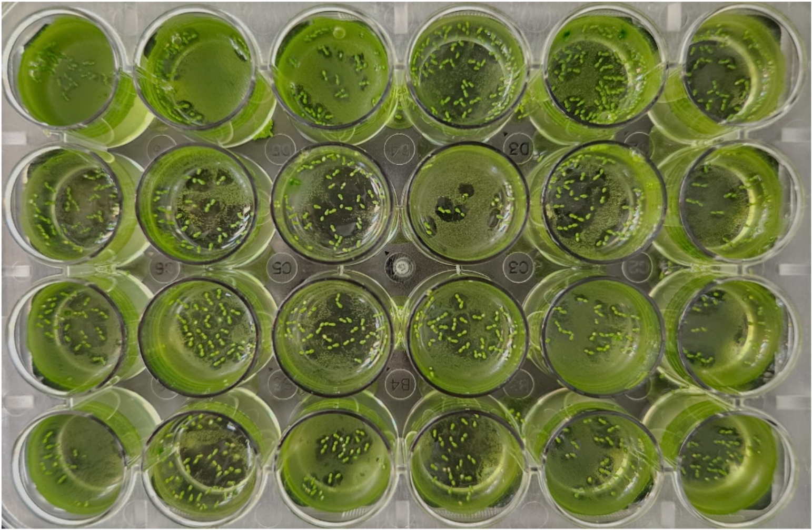

&nbsp;&nbsp;&nbsp;&nbsp;&nbsp;&nbsp;Cyanobacteria can establish populations in the water during duckweed cultivation. Even at concentrations as low as 0.075µg/mL, cyanobacteria significantly reduce duckweed growth and chlorophyll content. (Saqrane et al., 2007) Duckweed is a free floating plant and cyanobacteria at these concentrations often remain at the water surface alongside the plants. (Delgopiatof et al., 2024) Thus, it is important to maintain low cyanobacteria levels in cultivation systems to optimize duckweed growth and protein yield.

# 2. Design Product
**2.1. Value Proposition** (Jingten) 

&nbsp;&nbsp;&nbsp;&nbsp;&nbsp;&nbsp;Our goal of the project and value proposition is: to develop a low-cost real-time optical sensor with an integrated filter to prevent cyanobacteria growth in indoor duckweed farms. 

  **2.2. Stakeholder Analysis** (Jingten)

&nbsp;&nbsp;&nbsp;&nbsp;&nbsp;&nbsp;As indoor farms struggle to remain viable due to the high cost of set up and extensive energy demand, we aim to create a low cost sensor for SME indoor farms that allows them to integrate smart agriculture to increase yield and reduce loss. 
	
&nbsp;&nbsp;&nbsp;&nbsp;&nbsp;&nbsp;We were inspired by Dr. Yuchen Long’s research on duckweed, and through the conversation we learnt the negative impact of phytoplankton contamination in duckweed tanks may take over the space and greatly compete with duckweed for available nutrients and space. However, as both duckweed and cyanobacteria use the same nutrients for growth, without the use of algaecide, it is difficult to eliminate cyanobacteria. He mentioned that it is crucial to promote duckweed growth at an early stage as it could suppress cyanobacteria proliferation by taking up the nutrient and light required for photosynthesis and cyanobacteria. This could be applied in indoor duckweed farms, as cyanobacteria growth is commonly found in hydroponics systems.

  **2.3. Design Requirements** (Shannen) 

&nbsp;&nbsp;&nbsp;&nbsp;&nbsp;&nbsp;Our target users are small and medium enterprises (SMEs) indoor farms in Singapore. We aim to provide a solution that is affordable, easy to maintain and simple to operate, while ensuring reliable detection performance. To meet these goals, the design of our optical cyanobacteria sensor is guided by the following considerations: 

2.3.1. *Practical Considerations*

| |  |
| :--- | :--- |
|  **Affordability** | The unit price should remain below SGD $1,000 to ensure accessibility for SMEs to encourage adoption. The lowest price on the market is USD 1,995. |
|  **Portability** | The sensor must be compact and lightweight to support relocation within multi-tank facilities. Transfers should be quick and non-disruptive to farming operations.  |
| **Ease of use** | The sensor should be simple to operate for users with minimal technical training. Sensor readings and real-time cyanobacteria concentrations must be easily accessible and clearly interpreted. This includes an intuitive user interface, clear display of results and guided workflow. Furthermore, users can collect readings without disturbing the duckweed or water system.  |

2.3.2. *Technical Considerations*

| |  |
| :--- | :--- |
|  **Detection Limits** | The sensor must detect cyanobacteria concentrations low enough to prevent harmful effects on duckweed. Growth and chlorophyll content of duckweed decrease significantly at 0.075 μg/mL =7.5106 cells/mL. (Saqrane et al., 2007) Therefore, the system must trigger alerts at or below this threshold to ensure early intervention.  |
|  **Ease of Maintenance** | The device should remain functional with minimal servicing effort and without requiring users to handle water or internal components. Maintenance procedures must be simple, safe and infrequent.   &nbsp;&nbsp;- Accessible components: no need for users to submerge their hands or remove the sensor fully from the system.  &nbsp;&nbsp;- Long operational lifespan: battery designed to last 3 months without replacement or charging.   &nbsp;&nbsp;- Regular sampling: assuming cyanobacteria can double every 1.5-2 hours under favourable conditions (Wend et al., 2022), the measurements will be taken at least once every 3 hours to capture exponential growth phases.   &nbsp;&nbsp;- Minimal calibration: system calibration should remain stable over time with clear prompts when checks are needed.   |
| **Filter Specification** |The filter should effectively separate duckweed from the water to be filtered, and the cyanobacteria should be removed from the filtered water.   |

# 3. Detail Design 
Our proposed design is made out of three components.

|Component | Description |
| :--- | :--- |
|  **Sensor** | Measures the absorbance of water in duckweed tanks at 620nm correlated to the phycocyanin pigment in cyanobacteria. |
|  **Calibration and Processing** | Translates the absorbance readings measured by the sensor into cyanobacteria count.  |
| **Filter** | Removes the cyanobacteria from the duckweed tank.  |

  **3.1 Sensor** 

3.1.1. *State-of-the-Art Review* (Jingten)

&nbsp;&nbsp;&nbsp;&nbsp;&nbsp;&nbsp;Monitoring cyanobacteria is critical in water quality management and agriculture. However, most existing methods are designed for large scale environments like lakes, reservoirs and drinking water systems, and their application to compact, controlled setups like indoor duckweed farms remains limited. Current methods that are commonly used suffer from the trade-off between convenience and accuracy. 
	
&nbsp;&nbsp;&nbsp;&nbsp;&nbsp;&nbsp;Methods such as ELISA kits (immunoassay-based) and Liquid Chromatography-Mass Spectrometry (LC-MS, chemical quantification of cyanotoxin) detect cyanotoxins with high specificity, but it requires lab processing, trained personnel, expensive and non-portable, thus not suitable for real-time or in-situ monitoring.

&nbsp;&nbsp;&nbsp;&nbsp;&nbsp;&nbsp;To provide timely alert of cyanobacteria growth for indoor duckweed farms, real-time sensing is vital. The current available technology could be summarized as satellite imaging, imaging with machine learning, and optical sensors. Satellite imaging that tracks surface-level bloom is commonly used for large water bodies, which lacks resolution for small-scale indoor systems. (NC State, 2021) Alternatively, machine learning may be applied along with imaging. While it is promising, they often depend on large datasets and computational resources, making it costly and highly dependent on the available data for training. Therefore in our project, we choose to focus on optical sensors, which are the most common form of sensor available on the market that provides real-time sensing. 
	
&nbsp;&nbsp;&nbsp;&nbsp;&nbsp;&nbsp;Currently most optical sensors used for field research are fluorescence-based. While it is a promising solution for in-situ monitoring, its accuracy and reading is highly affected by environmental factors such as turbidity, temperature, or pH, which leads to unreliable estimation of biomass. Additionally, the complex calibration process also acts as a barrier to easy adoption by users to whom cyanobacteria monitoring may be a component to a complex system like duckweed farm.
	
&nbsp;&nbsp;&nbsp;&nbsp;&nbsp;&nbsp;To simplify the complex system and lower the cost of production, our project focuses on absorbance-based sensors. While it has lower accuracy compared to the fluorescence-based sensor, it is a necessary trade-off for it to address the limitation of cost and complexity in existing sensor systems.

3.1.2. *Development of the Optical Sensor* (Isaac)

We have developed 4 concepts and will assess which concept best addresses the design requirements.

Submerged Long Term (LT) Line Power
Submerged Battery Inductive
Separated External Line Power
Separated External Battery

| | Line Power | Battery |
| :--- | :--- | --- |
|  **Submerged Unified** | Submerged Long Term (LT) Line Power | Submerged Battery (inductive) |
|  **Separated External** | Separated External Line Power | Separated External Battery |

| | Line Power | Battery | | |
| :--- | :--- | --- | --- | --- |
|  **Affordability** | ++ | + | ++ | ++ |
|  **Ease of Set Up** | + | +++ | ++ | ++ |
|  **Operational Endurance** | +++ | ++ | +++ | ++ |
|  **Ease of maintenance** | + | ++ | ++ | ++ |
|  **Accuracy (all with the same internals)** | ++ | ++ | ++ | ++ |
|  **Ease of measurement and viewing of results** | + (no 7 segment display, direct connection to computer) | + (no 7 segment display, direct connection to computer)| ++ (have 7 segment / LCD display) | ++ (have 7 segment / LCD display) |
|  **Portability** |+ | +++ | ++ | ++ |
|  **Total Score** | 11 | 14 | 15 | 16 |

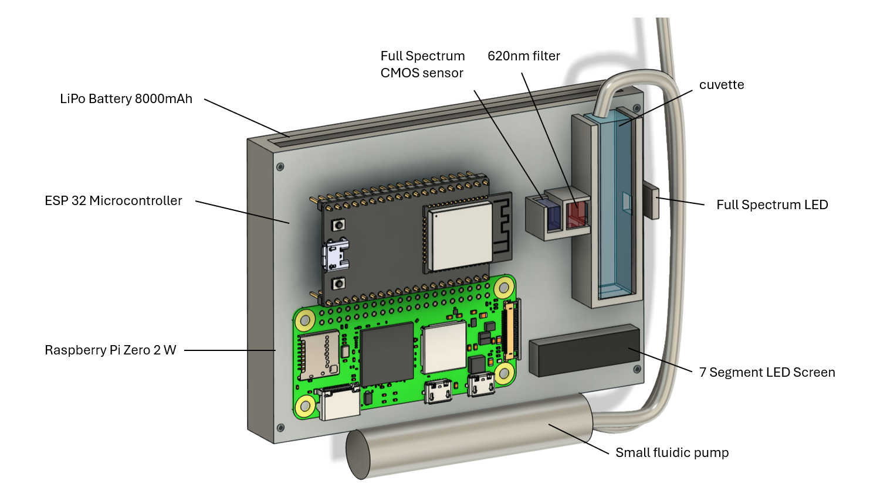

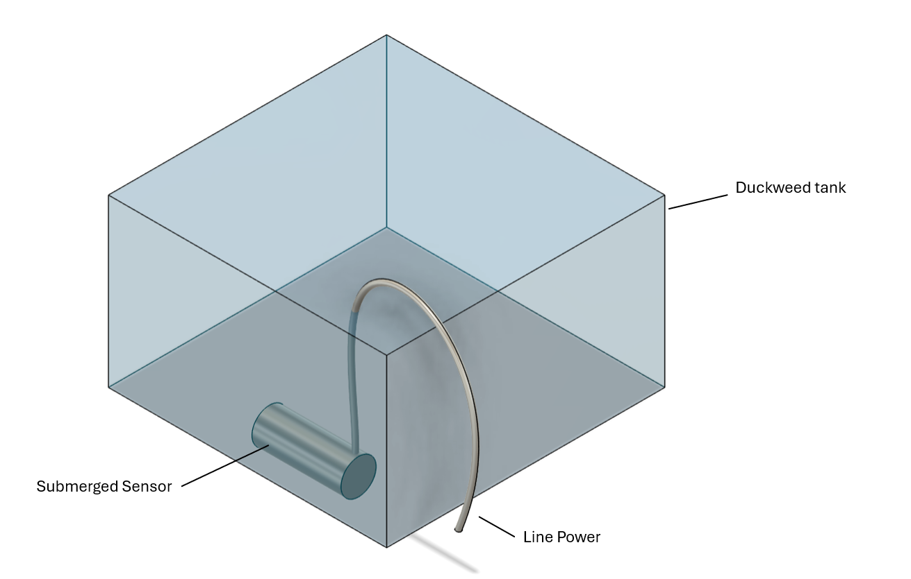

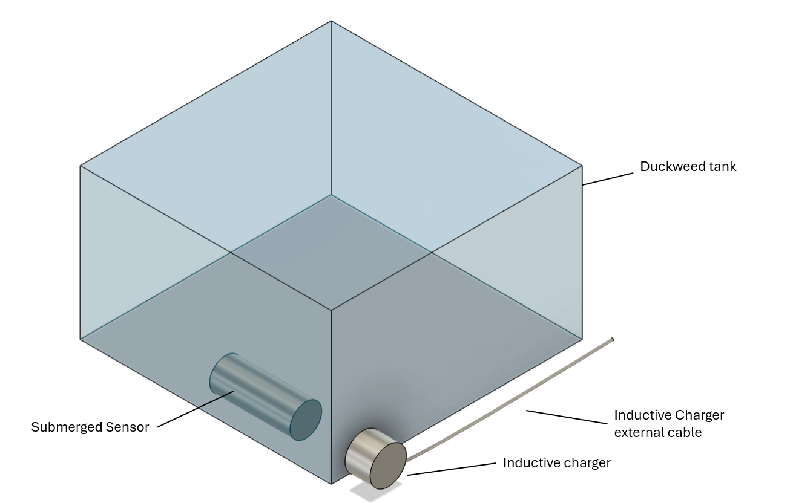

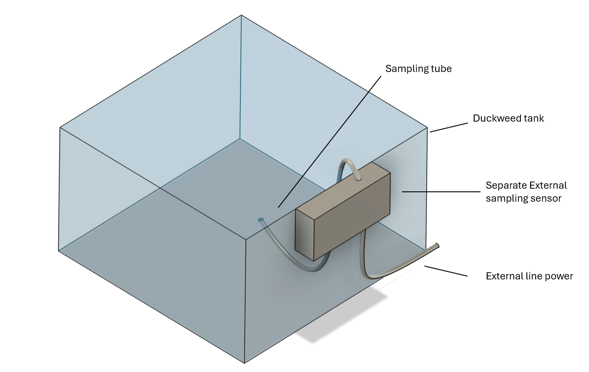

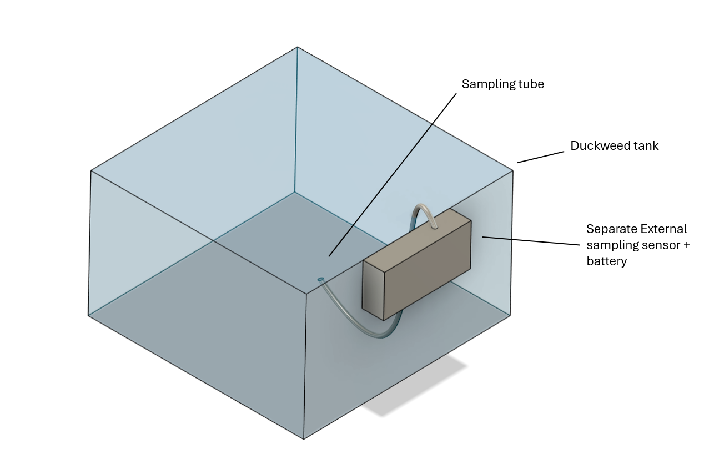

3.1.3. *Points of Consideration* (Isaac) 

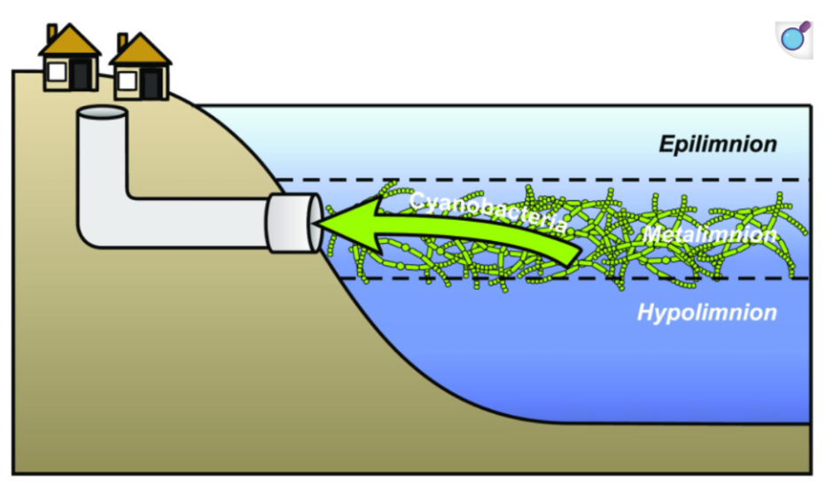

1. Location of the sensor (depth)
2. Numbers of sampling sites

	As the sensor plays the pivotal role to trigger any actions, it is important that the value detected is representative of the whole duckweed tank. While most cyanobacteria bloom occurs on the surface, cyanobacteria are not limited to the epilimnion layer of the water body. (Erratt et al., 2022)  Toxin-producing cyanobacteria could be present throughout the water column, and the density at which they occur could vary. (de Boutray et al., 2011) Therefore we have to consider whether to homogenize the water right before sampling for a generalized sample, or to further consider the location in which the sensor is placed and the number of sampling sites that would produce a reliable, unbiased value. 

  **3.2. Calibration Curve Relating Absorbance and Concentration of Cyanobacteria** (Shannen) 

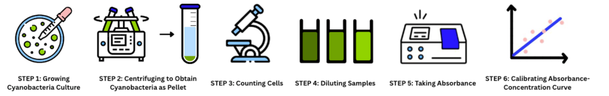

3.2.1. *Cell Culture*

1. Prepare 50 mL of growth medium in a flask using the same nutrient composition for duckweed growth.
2. Use a portion of the duckweed culture solution as the inoculum to initiate the cyanobacteria culture.
3. Cover the culture using parafilm to prevent contamination.
4. Allow the culture to grow in the same temperature and light conditions used for duckweed.
5. Take regular measurements to determine when the culture concentration reaches 1x108 cells/mL, using the cell counting protocol below.
6. Repeat steps 1-5 to prepare additional cyanobacteria cultures and grow for the determined incubation periods. 

3.2.2. *Cell Count*

1. Centrifuge 10 mL of cell suspension for 10 mins at 3000 x g. Discard the supernatant. (Rudi et al., 1998)
2. Resuspend the pellet in 8 mL of deionised water.
3. Load 6 µL of solution into the sample injection point on the hemacytometer (Figure 1).
4. Place the counting chamber on the stage of the microscope and focus on the cells.
5. Count the cells in the squares labelled A to E (Figure 1).
6. Calculate cell concentration using:cell concentration (cells/mL) = total cells counted volume of the compartments counted dilution factor volume counted=number of squares volume of each square

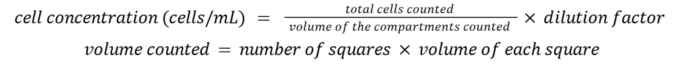

7. Keep remaining suspension as stock solution for calibration curve dilutions. 

3.2.3. *Absorbance Measurements*

1. Set the wavelength as 665 nm on the UV-Vis spectrophotometer.
2. Pipette 1 mL of deionised water into the reference and sampling cuvette.
3. Wipe the cuvette surface and place the reference and sampling cuvette in the spectrophotometer.
4. Blank the background medium absorbance.
5. Pipette 1 mL of cell suspension into the sampling cuvette and measure absorbance. 

3.2.4. *Standard Calibration Curve*

1. Mix the cell suspension and prepare dilution series in deionised water.
2. Mix 2 mL of the given cell culture with 2 mL of deionised water (1:2) in a centrifuge tube (10 mL capacity).
3. Mix 2 mL of the resultant diluted cell suspension with 2 mL of deionised water in another tube (1:4).
4. Repeat the process until you have produced 10 dilutions. After each dilution, mix well and use a new pipette tip for the next dilution.
5. Measure the optical density of the stock and diluted cell suspensions using UV-Vis spectrophotometer.
6. Calculate absorbance using the Beer-Lambert Law: A=lc where A: absorbance, =: molar absorptivity, l=1 cm: path length of the cuvette and c: cell concentration

7. Plot absorbance against cell concentration to obtain a calibration curve. 

3.2.5. *Reading Processing* (Jingten)

&nbsp;&nbsp;&nbsp;&nbsp;&nbsp;&nbsp;The absorbance at specific wavelengths associated with cyanobacterial pigments will be processed to estimate cyanobacterial density through an analytical workflow using the calibration curve obtained. First, the raw absorbance data is corrected for background interference by subtracting non-specific signals from blank readings, caused by turbidity or dissolved organic matter from duckweed growth to ensure specific absorbance. The corrected value is applied to the calibration curve obtained using known concentration of cyanobacteria, which defines the mathematical relationship between absorbance and bacteria density through the Beer-Lambert Law. The sensor outputs a real-time estimate of cyanobacterial density, which will be displayed at the side of the tank with an optional alert system when threshold density is exceeded. This enables farmers to monitor cyanobacteria dynamics continuously and intervene before the bacteria contamination affects duckweed health. 

  **3.3. Removal and Management of Detected Cyanobacteria** (Jingten)

The filter is divided into two core functions:
- Cyanobacteria cell removal: physically separates cyanobacteria from the main duckweed tank 
- Cyanotoxin neutralization: neutralizes dissolved cyanotoxins released by cyanobacteria in the water

3.3.1. *Filter*

&nbsp;&nbsp;&nbsp;&nbsp;&nbsp;&nbsp;To remove cyanobacteria, microscreen filters (10 μm mesh) can be used to trap suspended cyanobacteria cells. These filters are widely adopted in aquaculture and water treatment for their efficiency and scalability, and have been shown to effectively remove majority of the phytoplankton in the water. (Czyżewska & Piontek, 2019)
In addition to mechanical filtration, flocculants such as chitosan and polyaluminium chloride (PAC) are used to aggregate cyanobacteria into larger masses called flocs that settle or filter more easily. (Noyma et al., 2016) While chitosan is commonly preferred for its plant-safe applications due to low toxicity, it is shown to damage Microcystis aeruginosa through lysing the cells, causing the cyanotoxins to be released into the water. (Serrà et al., 2021) With this in mind, the chemical coagulation of cyanobacteria through flocculants will be completed in a separate tank to prevent the direct contact between the duckweed and toxins, and the potential uptake of the toxins by duckweed plant.

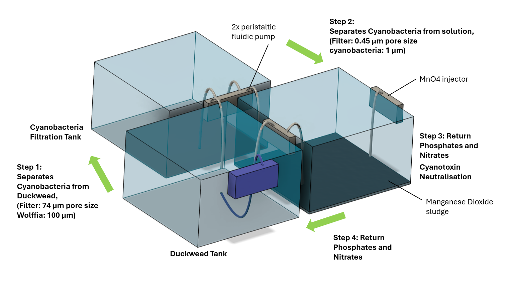

3.3.2. *Management of Cyanobacteria*

&nbsp;&nbsp;&nbsp;&nbsp;&nbsp;&nbsp;After cell removal, dissolved toxins may remain in the water. Given the high cyanobacteria growth rate, it is highly likely the water is rich in essential nutrients for plant growth such as nitrogen and phosphorus, it should not be simply discarded to fully utilize the nutrients and prevent fertilizer runoff that causes downstream eutrophication. We aim to remove the cyanotoxins present in the water following the removal of cyanobacteria cells, and reuse the water in the main duckweed tank. 
One of the most widely used methods for cyanotoxin removal is activated carbon adsorption. This relies on the porous structure of activated carbon to physically adsorb dissolved cyanotoxins from the water. However, its performance could be hindered by factors such as contact ime, carbon type, water quality, and the process can be costly due to the need for regeneration and reactivation of the carbon. (Abbas et al., 2020)

&nbsp;&nbsp;&nbsp;&nbsp;&nbsp;&nbsp;Another novel alternative to degrade cyanobacteria is potassium permanganate, which is a strong oxidizing agent that has been shown to effectively oxidize cyanotoxins such as microcystins and anatoxins into non-toxic form by alternating the molecular structure. (Li et al., 2021) Cyanotoxins is shown to be effectively neutralized by adding the optimal dosage of the potassium permanganate, and it is shown to cause less damage to the cellular membrane of cyanobacteria, leading to lower extracellular cyanotoxin levels. Considering the simplicity and cost of the method, we intend to explore the integration of potassium permanganate dosing in the system.

# 4. Validation of Design (Jingten)

**4.1. Cyanobacteria and Duckweed Growth** 

1. Using the appropriate environmental conditions and growth medium, allow duckweed and cyanobacteria to grow in a tank.
2. Take regular measurements to determine when the cyanobacteria level reaches 1x108 cells/mL, using the cell counting protocol above. 

  **4.2. Measurements Using UV Spectrometer and Our Sensor**

1. Take frequent measurements using the UV spectrometer.
2. Record the corresponding sensor reading.
3. Repeat measurements at different locations as cyanobacteria populations can be non-homogeneous.  

  **4.3. Determination of the Sensor’s Accuracy**

To confirm whether the biosensor accurately tracks cyanobacteria pigment concentrations and population density. 
1. Plot sensor-derived cell concentrations with hemocytometer counts to validate interpretation of optical signals. sensor derived cell concentration=mcell count+b

2. Calculate the accuracy using percent error=sensor estimate-cell countcell count100%

3. Refine calibration if needed, using regression analysis to improve the mapping between optical signal and actual cell concentrations.

  **4.4. Determination of the Sensor’s Sensitivity**

Validate that the biosensor can reliably detect concentrations at or below 0.075 μg/mL, ensuring it meets the early warning design specification. 
1. Plot sensor readings against the UV spectrometer absorbance values.

2. Perform regression analysis to determine correlation and establish a calibration equation.sensor absorbance values=nUV spectrometer absorbance values+c
3. Calculate the limit of detection (LOD) and limit of quantification (LOQ) using (Tabarin et al., n.d.):LOD=3.3  SD of Blankn and LOQ=10  SD of Blankn
- SD of Blank is the standard deviation of 5 blank measurements of the growth medium using the sensor. 

  **4.5. Impact of Filter on The Duckweed Tank System**

1. With an undisturbed duckweed tank as control, measure the impact of integrating the filter into the system with varied filter frequency (every 12 hours, 24 hours, 36 hours, 48 hours). As agitated water surface is shown to be a stressor in duckweed growth (Ziegler et al., 2023), it is vital to establish that the filtration method to remove cyanobacteria from the tank does not significantly impact the duckweed growth.
2. Additional mitigation methods for cyanobacteria in the water tank should also be studied for their effects on the duckweed growth, which is quantified by the following criteria: duckweed growth rate (doubling time), dry mass, total mass, and dormant turion formation in duckweed tank.
3. Using the appropriate environmental conditions and growth medium, allow duckweed and cyanobacteria to grow in a tank.

# 5. Project Plan (Jingten)
**5.1. Gantt Chart**

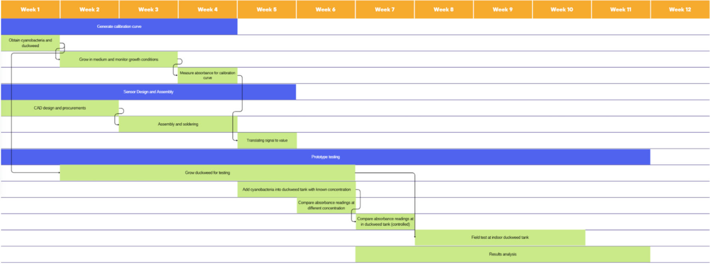

&nbsp;&nbsp;&nbsp;&nbsp;&nbsp;&nbsp;The Gantt Chart outlines the timeline for the prototyping and testing phase of the project to be carried out in the next semester over 10 weeks. To optimize for efficiency, the biosensor hardware development is carried out concurrently with biological preparations (sample cultivation). While the testing span throughout the whole chart due to the duckweed tank setup, testing the biosensor hinges on the design and assembly of the biosensor. Therefore, activities with high priority are carried out at the start of the prototyping phase.

  **5.2. Project Risk Assessment**

Several risks have been identified that could impact the timeline of the project:
| **Risk** | **Consequence** | **Mitigation** |
| :---: | :---: | :---: |
| Contamination in cyanobacteria culture | Unable to create calibration curve | Maintain backup culture past the phase |
| Duckweed death | Unable to conduct field testing | Maintain backup culture past the phase |
| Cyanobacteria density not dense enough for sensing | Sensor unable to provide reliable readings for analysis | Centrifuge to concentrate the cyanobacteria culture and more growth medium |
| Prototype components not delivered in time | Unable to build prototype | Explore alternative local suppliers (even at a higher cost) and push back the testing phase|
| Components failure/destroyed during assembly | Biosensor unable to function. Getting the components again may lead to delay in timeline | Buy spare supplies and explore alternative materials|

  **5.3. Laboratory Use**

&nbsp;&nbsp;&nbsp;&nbsp;&nbsp;&nbsp;All biological work (cyanobacteria cultivation, calibration curve development, duckweed culture) will be conducted in a Biosafety Level 1 (BSL-1) lab with facilities such as spectrophotometers, microscope, and centrifuge. As this serves as the basis for the calibration curve and further testing and validation, culturing duckweed and cyanobacteria will be the first step in the prototyping phase, and for the first four weeks, it will be monitored every two days to ensure healthy growth. 
Duckweed tanks will also be set up in the field testing phase.

# References

Abbas, T., Kajjumba, G. W., Ejjada, M., Masrura, S. U., Marti, E. J., Khan, E., & Jones-Lepp, T. L. (2020). Recent Advancements in the Removal of Cyanotoxins from Water Using Conventional and Modified Adsorbents—A Contemporary Review. Water, 12(10), 2756. https://doi.org/10.3390/w12102756

An, C., Ye Htut Zwe, Mei, M., Shang, G., Ling, Y., Poh, B. L., Zhou, W., & Li, D. (2024). Sanitization of hydroponic farming facilities in Singapore: what, why, and how. Applied and Environmental Microbiology. https://doi.org/10.1128/aem.00672-24

Anthem, P. (2025, July 7). Food security – what it means and why it matters. World Food Programme. https://www.wfp.org/stories/food-security-what-it-means-and-why-it-matters

Appenroth, Klaus-J., Sree, K. S., Böhm, V., Hammann, S., Vetter, W., Leiterer, M., & Jahreis, G. (2017). Nutritional value of duckweeds (Lemnaceae) as human food. Food Chemistry, 217, 266–273. https://doi.org/10.1016/j.foodchem.2016.08.116

Begum, S. (2020, September 9). Nine high-tech farms in Singapore awarded nearly $40 million to ramp up food production. The Straits Times. https://www.straitstimes.com/singapore/nine-high-tech-farms-in-singapore-awarded-nearly-40-million-to-ramp-up-food-production

Begum, S. (2025a, June 5). Plan in place to help local farms produce more, stay financially viable: SFA chief. The Straits Times. https://www.straitstimes.com/singapore/environment/plan-in-place-to-help-local-farms-produce-more-stay-financially-viable-sfa-chief

Begum, S. (2025b, November 4). Singapore drops “30 by 30” farming goal, sets revised targets for fibre and protein by 2035. The Straits Times. https://www.straitstimes.com/singapore/environment/singapores-30-by-30-farming-goal-pushed-back-to-2035-with-revised-targets-for-fibre-and-protein

Bhardwaj, R. L., Parashar, A., Parewa, H. P., & Vyas, L. (2024). An Alarming Decline in the Nutritional Quality of Foods: The Biggest Challenge for Future Generations’ Health. Foods, 13(6), 877. https://doi.org/10.3390/foods13060877

Bhaswant, M., Shanmugam, D. K., Miyazawa, T., Abe, C., & Miyazawa, T. (2023). Microgreens-A Comprehensive Review of Bioactive Molecules and Health Benefits. Molecules (Basel, Switzerland), 28(2), 867. https://doi.org/10.3390/molecules28020867

Czyżewska, W., & Piontek, M. (2019). The Efficiency of Microstrainers Filtration in the Process of Removing Phytoplankton with Special Consideration of Cyanobacteria. Toxins, 11(5), 285. https://doi.org/10.3390/toxins11050285

Delgopiatof, M., Bai, M., Bushey, S., & Syme, V. (2024, June 10). Mechanics and Optics of Cyanobacteria: How to Survive over Billions of Years - Bioengineering Hyperbook. Bioengineering Hyperbook. https://bioengineering.hyperbook.mcgill.ca/mechanics-and-optics-of-cyanobacteria-how-to-survive-over-billions-of-years/

Dorward, A. (2013). Agricultural labour productivity, food prices and sustainable development impacts and indicators. Food Policy, 39, 40–50. https://doi.org/10.1016/j.foodpol.2012.12.003

EDB . (2025). Edb.gov.sg. https://www.edb.gov.sg/en/about-edb/media-releases-publications/dutch-indoor-farming-company-rowy-opens-new-vertical-farm-in-singapore.html

FAO, IFAD, UNICEF, WFP, & WHO. (2025). The State of Food Security and Nutrition in the World 2025. https://doi.org/10.4060/cd6008en

Hoenink, J. C., Garrott, K., Jones, N. R. V., Conklin, A. I., Monsivais, P., & Adams, J. (2024). Changes in UK Price Disparities between Healthy and Less Healthy Foods over 10 years: an Updated Analysis with Insights in the Context of Inflationary Increases in the cost-of-living from 2021. Appetite, 197(107290), 107290–107290. https://doi.org/10.1016/j.appet.2024.107290

Javaid, M., Haleem, A., Singh, R. P., & Suman, R. (2022). Enhancing smart farming through the applications of Agriculture 4.0 technologies. International Journal of Intelligent Networks, 3(1), 150–164. https://doi.org/10.1016/j.ijin.2022.09.004

Kaur, S., Bedi, M., Singh, S., Kour, N., Bhatti, S. S., Bhatia, A., Kumar, M., & Kumar, R. (2024). Monoculture of crops: A challenge in attaining food security. In Advances in Food Security and Sustainability (Vol. 9, pp. 197–213). Elsevier. https://doi.org/10.1016/bs.af2s.2024.07.008

Kish, B. (2024, February 15). Here Are the 4 Biggest Benefits of Indoor Farming. CEAg World. https://www.ceagworld.com/greenhouse-produce/here-are-the-4-biggest-benefits-of-indoor-farming/

Li, X., Zeng, J., & Yu, X. (2021). Potassium permanganate as a promising pre-oxidant to treat low-viability cyanobacteria and associated removal of cyanotoxins and extracellular organic matters. Water Research, 202, 117353. https://doi.org/10.1016/j.watres.2021.117353

Lim, K. T. (2021, February 10). Singapore: Food Security despite the Odds. Food for Thought; Singapore Food Agency. https://www.sfa.gov.sg/food-for-thought/article/detail/singapore-food-security-despite-the-odds

Loh, R. (2024, October 19). With several farms closing or struggling to break even, what is the future for agriculture in Singapore? CNA. https://www.channelnewsasia.com/today/big-read/high-tech-low-returns-farming-4684566

NC State. (2021). Supporting Cyanobacterial Bloom Monitoring with Satellite Imagery | NC State Extension Publications. Content.ces.ncsu.edu. https://content.ces.ncsu.edu/supporting-cyanobacterial-bloom-monitoring-with-satellite-imagery

Noyma, N. P., de Magalhães, L., Furtado, L. L., Mucci, M., van Oosterhout, F., Huszar, V. L. M., Marinho, M. M., & Lürling, M. (2016). Controlling cyanobacterial blooms through effective flocculation and sedimentation with combined use of flocculants and phosphorus adsorbing natural soil and modified clay. Water Research, 97, 26–38. https://doi.org/10.1016/j.watres.2015.11.057

NParks. (2023). Xiao Bai Cai. Nparks.gov.sg. https://gardeningsg.nparks.gov.sg/page-index/edible-plants/xiao-bai-cai/

Park, I. (2022, December 13). A Timeline of the Three Major Agricultural Revolutions in History. Population Education. https://populationeducation.org/a-timeline-of-the-three-major-agricultural-revolutions-in-history/

Pereira . (2009). Green Revolution. In Encyclopædia Britannica. https://www.britannica.com/event/green-revolution

Popkin, B. M., & Ng, S. W. (2021). The nutrition transition to a stage of high obesity and noncommunicable disease prevalence dominated by ultra‐processed foods is not inevitable. Obesity Reviews, 23(1). https://doi.org/10.1111/obr.13366

Rathor, A. S., Choudhury, S., Sharma, A., Nautiyal, P., & Shah, G. (2024). Empowering Vertical Farming through IoT and AI-Driven Technologies: A Comprehensive Review. Heliyon, 10(15), e34998–e34998. https://doi.org/10.1016/j.heliyon.2024.e34998

Rudi, K., Larsen, F., & Jakobsen, K. S. (1998). Detection of Toxin-Producing Cyanobacteria by Use of Paramagnetic Beads for Cell Concentration and DNA Purification. Applied and Environmental Microbiology, 64(1), 34–37. https://doi.org/10.1128/aem.64.1.34-37.1998

Saqrane, S., ghazali, I. E., Ouahid, Y., Hassni, M. E., Hadrami, I. E., Bouarab, L., del Campo, F. F., Oudra, B., & Vasconcelos, V. (2007). Phytotoxic effects of cyanobacteria extract on the aquatic plant Lemna gibba: Microcystin accumulation, detoxication and oxidative stress induction. Aquatic Toxicology, 83(4), 284–294. https://doi.org/10.1016/j.aquatox.2007.05.004

Saunders, J., & Smith, T. (2010). Malnutrition: Causes and consequences. Clinical Medicine, 10(6), 624–627. https://doi.org/10.7861/clinmedicine.10-6-624

ScienceDirect. (2016). Duckweed - an overview | ScienceDirect Topics. Sciencedirect.com. https://www.sciencedirect.com/topics/earth-and-planetary-sciences/duckweed

Serrà, A., Philippe, L., & Gómez, E. (2021). Removal of Cyanobacteria and Cyanotoxins in Waters. Toxins, 13(9), 636. https://doi.org/10.3390/toxins13090636

SFA. (2023, December 13). Agriculture Technologies. Default. https://www.sfa.gov.sg/food-science-and-technology/technology/agriculture-technologies

Singapore Green Plan 2030. (2024). Our Targets. Www.greenplan.gov.sg. https://www.greenplan.gov.sg/targets/

Tabarin, A., Celeste M., L., J. Benoit, C., & Blandine, G.-C. (n.d.). Limit of Quantitation - an overview | ScienceDirect Topics. Www.sciencedirect.com. https://www.sciencedirect.com/topics/nursing-and-health-professions/limit-of-quantitation

Tan. (2019). Malnutrition. Healthhub.sg. https://www.healthhub.sg/health-conditions/malnutrition

Tan, C. (2022, August 7). $10 million centre launched to solve urban farming challenges, boost food security. The Straits Times. https://www.straitstimes.com/singapore/10-million-centre-launched-to-solve-urban-farming-challenges-boost-food-security

Teng, P., & Montesclaros, J. Ma. L. P. (2017). Community Gardens: Singapore’s “Fourth Food Basket”? RSIS_NTU. https://rsis.edu.sg/rsis-publication/rsis/community-gardens-singapores-fourth-food-basket/

Tham, D. (2024, June 29). IN FOCUS: Will Singapore meet its 30 by 30 food sustainability goal? CNA. https://www.channelnewsasia.com/singapore/vegetables-seafood-singapore-food-price-cost-farmers-security-4442626

Verdouw, C., Tekinerdogan, B., Beulens, A., & Wolfert, S. (2021). Digital twins in smart farming. Agricultural Systems, 189, 103046. https://doi.org/10.1016/j.agsy.2020.103046

Wang, Z., Akbar, S., Sun, Y., Gu, L., Zhang, L., Lyu, K., Huang, Y., & Yang, Z. (2021). Cyanobacterial dominance and succession: Factors, mechanisms, predictions, and managements. Journal of Environmental Management, 297, 113281. https://doi.org/10.1016/j.jenvman.2021.113281

WebMD. (n.d.). Health Benefits of Bok Choy. WebMD. https://www.webmd.com/diet/health-benefits-bok-choy

Wendt, K. E., Walker, P., Sengupta, A., Ungerer, J., & Pakrasi, H. B. (2022). Engineering Natural Competence into the Fast-Growing Cyanobacterium Synechococcus elongatus Strain UTEX 2973. Applied and Environmental Microbiology, 88(1). https://doi.org/10.1128/aem.01882-21

World Bank Group. (2025). What is food security? World Bank. https://www.worldbank.org/en/topic/agriculture/brief/food-security-update/what-is-food-security

World Food Program USA. (2025, July 7). 6 Causes of World Hunger - Why There is Global Food Insecurity. World Food Program USA. https://www.wfpusa.org/hunger/issues/

Zięć, G., Michalski, O., Konieczna-Molenda, A., Dera, T., Tkaczewska, J., Zięć, G., Michalski, O., Konieczna-Molenda, A., Dera, T., & Tkaczewska, J. (2025). Nutritional Value, Health Properties, Safety Considerations, and Consumer Acceptance of Lemnoideae as Human Food. Nutrients, 17(18), 3026–3026. https://doi.org/10.3390/nu17183026

Ziegler, P., Appenroth, K. J., & Sree, K. S. (2023). Survival Strategies of Duckweeds, the World’s Smallest Angiosperms. Plants, 12(11), 2215. https://doi.org/10.3390/plants12112215

# Appendix

Definitions of Key Terms 
1. Undernourished: The prevalence of undernourishment is defined as the proportion of the population in each country who, on a regular basis, consume food in amounts that are insufficient to provide the energy required for a normal, active and healthy life. (FAO et al., 2025)
2. Malnutrition: Malnutrition is a serious condition that occurs when a person does not receive the right amount of nutrients. (Tan, 2019) 

**Calculations**

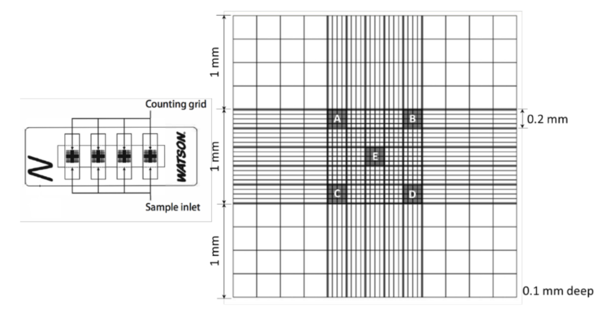

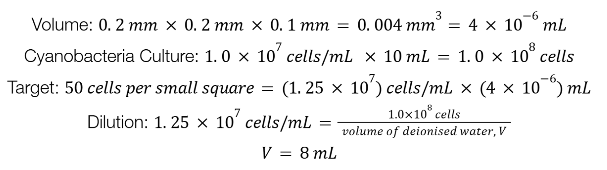
